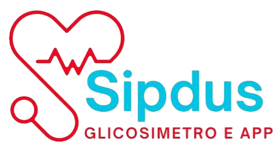

# Sipdus - Glicosímetro Não Invasivo

## Sobre o projeto
O Sipdus é um dispositivo portátil, não invasivo e indolor para monitoramento contínuo da glicemia, utilizando sensor óptico MAX30102 e Machine Learning. O projeto tem como objetivo tornar o acompanhamento da glicose mais prático, acessível e confortável, oferecendo uma alternativa à medição tradicional com punção.

## Problema e solução
**Problema:** Métodos tradicionais de medição glicêmica exigem punções repetidas ao longo do dia, causando dor, desconforto, risco de infecções e baixa adesão ao tratamento a longo prazo. Além disso, há carência de aplicativos eficazes para acompanhamento diário, fazendo com que o paciente dependa da própria memória para registrar medições.

**Solução:** Dispositivo com fotopletismografia (PPG) que estima níveis de glicose, BPM e SpO₂ sem perfurações, utilizando o sensor MAX30102 e algoritmos de Machine Learning. O sistema conta com um aplicativo mobile para gráficos personalizados, diário alimentar, alertas automáticos e assistente virtual sobre diabetes.

## Público-alvo
- Pessoas com diabetes Tipo 1 e Tipo 2
- Gestantes com diabetes gestacional
- Pessoas em situação de vulnerabilidade social com acesso limitado a tecnologias médicas

## Tecnologias utilizadas
- **Hardware:** ESP32, Sensor MAX30102, Display Touch, LVGL
- **Software:** React Native (App mobile), Bluetooth
- **Machine Learning:** Regressão Linear
- **Linguagens:** Python, C++, JavaScript
- **Impressão 3D:** PLA

## Equipe
- **Giovana Gomes de Souza** - Desenvolvimento & Mobile
- **Julia da Silva Rodrigues Ferreira** - Hardware & Eletrônica
- **Júlia Vieira Locatelli de Sousa** - Software & Design

## Identidade visual

- **Cor principal:** #24C1D8 (Azul)
- **Cor secundária:** #1A9BB0 (Azul escuro)
- **Cor destaque:** #DC1429 (Vermelho)
- **Cor de fundo:** #F0EEEE (Branco/cinza)
- **Tipografia:** Inter (Google Fonts)

## Links
- **Landing page:** https://sipdus.github.io
